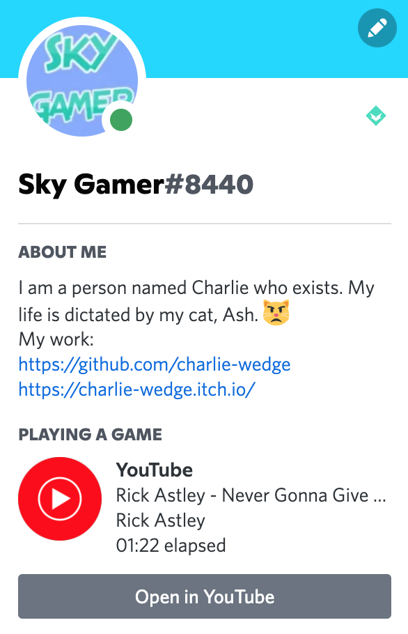

# YouTube Discord Status

Displays the current YouTube video playing onto your Discord profile as a rich presence.

**Before you run:**
> *You need to enter a Google API Key into the index.js script:*

- visit [Google Cloud Platform](https://console.cloud.google.com/)
[YOU DO NOT NEED TO START ANY TRIAL]
- Select "Select a project"
- Select "NEW PROJECT"
- Give it a name such as "YouTube Discord Status"
- Create
- Open the project (you may have to visit the original URL again and select "Select a project" again)
- Open the API page (you may have to open "Explore and enable APIs" under 'Getting Started')
- Press "Credentials" on the left
- Press "+ CREATE CREDENTIALS" at the top > API key
- Copy the API key into the googleAPIKey varaible inside the index.js
- DO NOT SHARE YOUR API KEY WITH ANYBODY

---------------------

> To run, you need Node.js installed:

If you haven't installed Node before, you can do so here:
[node.js download](https://nodejs.org/en/download/)

---------------------

> **To run:**

**Windows:**
- Open the `Start.bat` file.

**macOS:**
- Open Terminal

- Reference the directory of this folder. EG:
`cd /Users/admin/Documents/Node/YouTube\ Discord\ Status`
(You can also type `cd `  and drag the folder into the Terminal window)

- Run the script by typing:
`npm run dev`

---------------------

> Leave the cmd/terminal window open in the background to allow this script to run in the background. The script will only recognise YouTube tabs in Google Chrome - other web browsers are not yet supported. This script may or may not have problems in the web version of Discord.

---------------------

**Example:**

